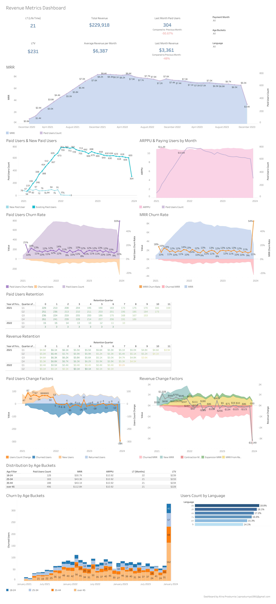

## **Proj#1** - Unit Economics in SaaS product
### **Table of Contents**
1. [Project Overview](#project-overview)
2. [Tools and Data Sources](#Tools-and-Data-Sources)
3. [Data Manipulation in Excel](#Data-Manipulation-in-Excel)
4. [Dashboard Creation in Public Tableau](#Dashboard-Creation-in-Public-Tableau)
5. [Contact Information](#Contact-Information)

#### 1. Project Overview:
For this project I extract and analyze data to evaluate key metrics such as MRR, ARPPU, lifetime value (LTV), and churn rate. The project utilizes segmentation techniques and cohort analysis to analyze pricing plans and subscription tiers. Dashboard is created to effectively monitor metrics, communicate findings and support data-driven decision-making. The project aims to improve business strategies, enhance product performance, and drive growth in the SaaS industry.

#### 2. Tools and Data Sources:
Tools: Excel, Public Tableau

Data Sources: The primary dataset for this analysis is the `SaaS project.csv` file, which contains detailed information about all subscriptions from 2021 to 2023. This dataset was generated using an AI and real-world subscription data was used as a reference.

#### 3. Data Manipulation in Excel:
In the initial phase, I worked with the raw data in Excel, introducing columns such as churn, back_from_churn, sub_plan level, downgrade sub_plan, and upgrade sub_plan. These additional columns play a crucial role in analyzing and understanding subscription dynamics.
- churn	
- back_from_churn	
- sub_plan level 
- downgrade sub_plan 
- upgrade sub_plan

You can find my excel file via this link: [Saas project](https://docs.google.com/spreadsheets/d/1jKPZ6eCd7lKUuNDw_hbNiY35V4Rxu99cMMHf4OKPu3M/edit?usp=sharing)

#### 4. Dashboard Creation in Public Tableau:
Following the data manipulation in Excel, I seamlessly transferred the `SaaS project.csv` file to Public Tableau, where I constructed a comprehensive dashboard. This dashboard features key metrics like MRR, ARPPU, LTV, and churn rate, accompanied by insightful graphics derived from cohort analysis. The visualization provides a user-friendly interface for stakeholders to make informed, data-driven decisions.

You can find my dashboard on Public Tableau via this link: [SaaS Revenue Dashboard](https://public.tableau.com/views/SaaSRevenueDashboard/Dashboard1?:language=en-US&:display_count=n&:origin=viz_share_link)

#### 5. Contact Information:
I welcome any inquiries or collaborations related to this project or other data analytics endeavors. Feel free to explore my LinkedIn profile for more details or contact me directly via email, Telegram, or phone:
- LinkedIn - [linkedin.com/in/alinaproskurnia/](https://www.linkedin.com/in/alinaproskurnia/)
- Email - aproskurnya1991@gmail.com
- Telegram - @aproskurnia
- Phone - +38(063)3547787
